<picture>
  <source media="(prefers-color-scheme: dark)" srcset="hero.svg">
  
</picture>

# context-file-evidence

Do `AGENTS.md` / `CLAUDE.md` files actually help coding agents? Four primary studies say four different things. This repo puts them in one grid, pins every number to its source version, and works out which disagreements are real.

**Short answer:** an agent with a context file finishes *faster* (verified, significant), does *not* measurably solve *more tasks* (the best-powered study can only bound any effect to ≤10–15pp), costs *more steps and reasoning tokens* wherever both are measured, and the headline "saves ~20% of tokens" is a mean artifact — the median run got slightly **more** expensive. The file's content decides which direction behavior moves, because agents obey these files almost mechanically. Details and quotes: [SYNTHESIS.md](SYNTHESIS.md).

| | |
|---|---|
| [matrix.md](matrix.md) | the grid: four studies × every measured axis, each cell citing its primary source |
| [SYNTHESIS.md](SYNTHESIS.md) | what the four studies establish together — the reconciliation, the mean/median finding, the power band |
| [studies/](studies/) | one page per study: what it measured, its verbatim results, what it cannot tell you |
| [research/](research/) | full extraction reports: every table transcribed, arithmetic re-verified, version deltas, evidence logs |
| [METHODOLOGY.md](METHODOLOGY.md) | the evidence contract — primary source or nothing, version pins, `unknown` over guess |

## The four studies

| Study | Axis | One-line finding |
|---|---|---|
| [Lulla et al. — arXiv:2601.20404 v2](studies/lulla-efficiency.md) | efficiency | 124 paired PR runs: faster (median −28.6%) and cheaper **on the mean only** — median total tokens rose 1.29% |
| [Gloaguen et al. — arXiv:2602.11988 v3](studies/gloaguen-success.md) | task success | LLM-generated files slightly reduce resolution and raise cost ~20%; developer files +2.4% (p=0.21 — not significant); overviews are worthless |
| [Khatri — arXiv:2607.27250](studies/two-agent-ablation.md) | correctness | A null with teeth: no detectable effect on two agents, bounded ≤10–15pp, with the power analysis to prove what that means |
| [Chatlatanagulchai et al. — arXiv:2511.12884 v2](studies/agent-readmes.md) | content (observational) | 2,303 real files: tests/builds/architecture everywhere, security 14.8%, performance 14.5% — and 11 of 16 percentages changed between v1 and v2 |

## Why this repo exists

The coverage of these papers is a telephone game. The efficiency paper's token savings circulate without its median; the success paper's v1 numbers ("−3%", "+4%") circulate after v3 revised them ("does not generally improve", "+2.4% p=21%"); the census's v1 percentages circulate after v2 moved 11 of 16; and two phrases that appear in **no version of any paper** — "CTXBENCH" and "almost to a fault" — circulate as quotes. Every number here was transcribed from the primary source, arithmetic-checked, and version-pinned. The extraction reports under [research/](research/) carry the evidence logs and the UNVERIFIED lists.

## How to read a cell

Every quantitative cell names its statistic (mean/median), its direction, and its significance test where one exists. `∅` is not "no effect" — it is "no effect detectable at this study's stated power", which is a different and weaker claim, and the grid says which. Where a paper's own versions disagree, the cell carries the version tag. Where a source contradicts secondary coverage, the study page shows both.

---

**Orvii** — Open, Research, Vision, Innovation & Ideas.

Sister repos: [harness-atlas](https://github.com/Orvii/harness-atlas) · [convention-map](https://github.com/Orvii/convention-map) · [bench-notes](https://github.com/Orvii/bench-notes) · [equivalence-notes](https://github.com/Orvii/equivalence-notes) · [provider-reliability](https://github.com/Orvii/provider-reliability) · [retractions](https://github.com/Orvii/retractions) · [svg-instruments](https://github.com/Orvii/svg-instruments).
